# 🚀 Introduction to Foresure

Welcome to **Foresure**, the next-generation multi-outcome prediction market platform built on the **Base Network**. 

Foresure empowers you to trade on your beliefs, create markets against real-world risks, and earn yields through a sophisticated hybrid automated market maker (AMM) system by providing liquidity.

If you would like to read the whitepaper (heavy math!), read it [here](https://www.dropbox.com/scl/fo/p2j80zjx3qwy5d8af4u0w/AFYS_75_cCAFftmPw2ZDXpA?rlkey=34dxgnzoklezmrb03134kq6gu&st=upmkf3pv&dl=0). 

We are still refining our documentation to give you the best guidance possible. So kindly let us know if you want to some more information on our project.

Let us jump in!

## 🌟 Platform Overview

Foresure isn't just another betting site or prediction market platform; We are premissionless decentralized platform. You can create markets for whatever you like! By combining the speed of Web2 with the trustless security of Web3, we offer a seamless, mobile-first experience that feels like a traditional app but runs entirely on smart contracts.

| Feature | Description |
| :--- | :--- |
| **⚡ Base Network** | Lightning-fast transactions and near-zero gas fees. |
| **🧠 Multi-Outcome** | Trade on markets with >2 outcomes (e.g., "Who will win the election?" vs just Yes/No). |
| **💧 Consensus AMM** | Deep liquidity and reduced slippage using our custom CAMM + Stablecoin invariant. |
| **📱 Mobile First** | A Progressive Web App (PWA) designed for trading on the go. |

##  Unique Value Proposition

### Why Foresure?

1.  **Dynamic Payouts**: Unlike traditional binary options, our payout curves adapt to probability shifts, offering better capital efficiency.
2.  **Optimistic Oracle**: We use a decentralized, optimistic oracle system that ensures fast resolution while maintaining a dispute window for security.
3.  **Jury System**: Community-led dispute resolution ensures fairness without centralization.
4.  **Truly Permissionless**: No need API or third party. All of our transactions are in BASE smart contracts. If you are developer, build to integrate prediction markets into your own dApps.

## 🏗️ Architecture

::: info Hybrid Design
Foresure combines a high-performance off-chain matching engine for discovery with on-chain settlement for security.
:::

### 🎬 Animated Architecture
<AnimatedArchitecture />

## 🗺️ User Journey

### 🎬 Animated Timeline

```mermaid
graph TD
    A[Connect Wallet] --> B{Has USDC?}
    B -- No --> C[Bridge / Swap on Base]
    B -- Yes --> D[Browse Markets]
    D --> E[Select Outcome]
    E --> F[Approve USDC]
    F --> G[Confirm Trade]
    G --> H[🎉 Position Open]
```

<AnimatedTimeline />

## 📚 Key Features 

*   **Market Creation**: Users can create Prediction Markets with multiple mutually exclusive outcomes.
*   **Trading**: Buy and sell outcome tokens. Prices are dynamic based on supply/demand (CAMM).
*   **Liquidity**: Shared liquidity pools across all outcomes for given prediciton market.
*   **Mobile First**: A Progressive Web App (PWA) design with a bottom navigation bar for mobile users.
*   **Hybrid Architecture**: Combines the speed of Web2 (Fastify/Postgres) with the trust of Web3 (Smart Contracts).

*   **Fee Structure**:

| Fee Type | Rate | Purpose |
| :--- | :--- | :--- |
| **Trading Fee** | **TBA%** | Distributed to LPs and Protocol Treasury. |
| **Protocol Fee** | **TBA%** | For Market Creation and using the platform |
 **Treasury** | **tBA%** | Funds development, security audits, and operations |

*Note: Complete details on Fees will presented during testnet release.**