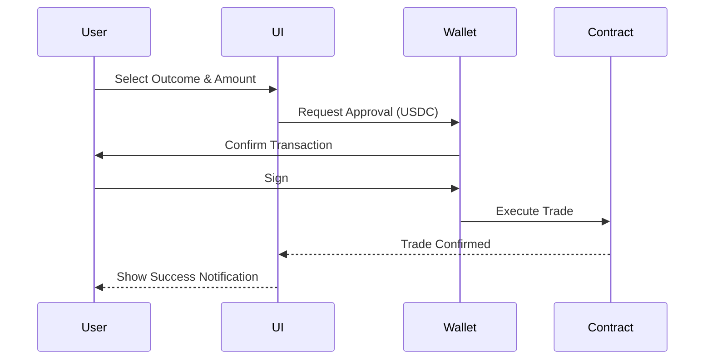

# ⚡ Quick Start Guide

*This documentation is in editing mode. The content here is not finalized.*

Ready to place your first trade? Follow this walkthrough to get started on Foresure in under 5 minutes.

## 1. Connect Your Wallet

Click the **Connect Wallet** button in the top right corner. We support major wallets like Coinbase Wallet, MetaMask, and Rainbow.

::: tip
New to crypto? Check out our [Wallet Setup Guide](./supported-wallets.md).
:::

## 2. Fund Your Wallet

You'll need **ETH** on Base for gas fees (very cheap!) and **USDC** (or supported stablecoin) for trading.

1.  Bridge ETH to Base using the [official bridge](https://bridge.base.org/).
2.  Swap for USDC on Uniswap or Aerodrome if you don't have it.

## 3. Explore Markets

Navigate to the **Markets** tab. You can filter by category:
*   🗳️ Politics
*   ⚽ Sports
*   📈 Crypto
*   🌍 Pop Culture

## 4. Place a Trade

1.  Select a market (e.g., "Will ETH hit $5k by Dec?").
2.  Choose an outcome: **YES** or **NO**.
3.  Enter the amount of USDC you want to invest.
4.  Review the **Potential Payout** and **Slippage**.
5.  Click **Buy**.

## 5. Monitor Your Portfolio

Go to the **Portfolio** tab to see your active positions. You can sell your position at any time before the market resolves to lock in profits or cut losses.

## 🎉 Congratulations!

You are now a prediction market trader. 

::: warning Risk Warning
Prediction markets are volatile. Never invest more than you can afford to lose.
:::
