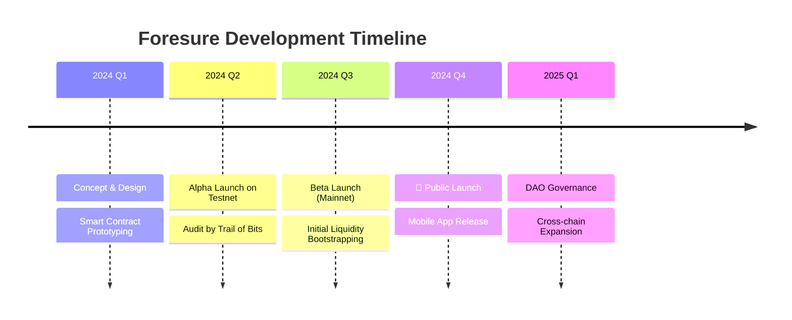

# 🗺️ Roadmap

*This documentation is in editing mode. The content here is not finalized.*

Our journey to revolutionize prediction markets is just beginning. Here is what we have planned.

## Phase 1: Foundation (Current)
- [x] **Core AMM Contracts**: Hybrid CAMM deployed.
- [x] **Basic UI/UX**: Mobile-responsive web app.
- [x] **Oracle Integration**: Optimistic oracle for resolution.
- [ ] **Referral System**: Earn fees by inviting traders.

## Phase 2: Growth & Decentralization
- [ ] **Juror Staking**: Decentralized dispute resolution.
- [ ] **Advanced Order Types**: Limit orders and stop-loss.
- [ ] **Social Features**: Leaderboards and trader profiles.

## Phase 3: Ecosystem
- [ ] **SDK Release**: Enable third-party frontends.
- [ ] **Layer 3**: Dedicated app-chain for high-frequency trading.
- [ ] **AI Agents**: Automated market making bots.

::: tip Stay Updated
Join our [Discord](https://discord.gg/foresure) to get the latest updates and participate in community calls.
:::
