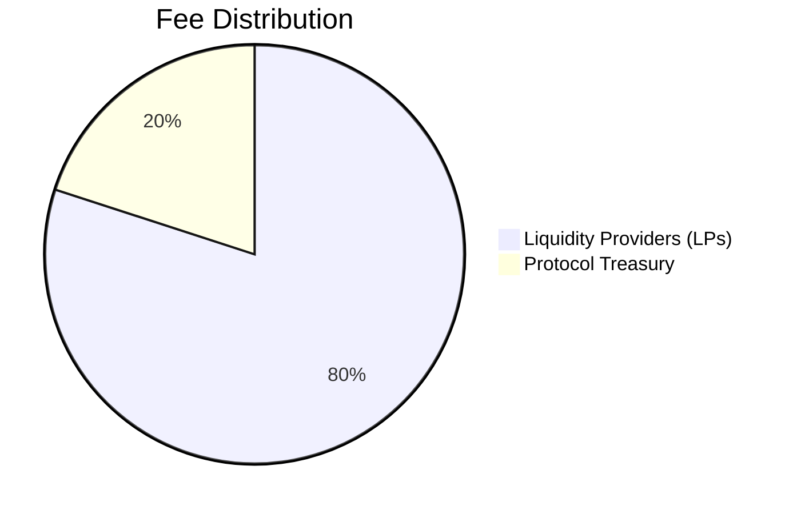
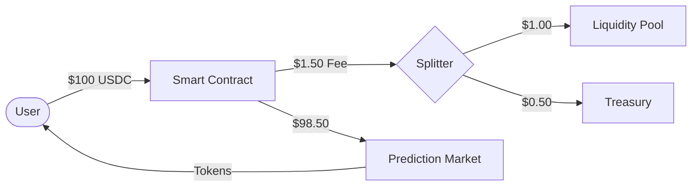

#  Protocol Economics

*This documentation is in editing mode. The content here is not finalized.*

Foresure generates revenue through trading fees, ensuring the sustainability of the platform without relying solely on token inflation.

## Fee Structure

Every trade on Foresure incurs a fee, which is split between Liquidity Providers (LPs) and the Protocol Treasury.

| Fee Type | Rate | Recipient | Purpose |
| :--- | :--- | :--- | :--- |
| **Liquidity Fee** | **1.0% - 5.0%** | **LPs** | Compensates LPs for risk and Impermanent Loss. |
| **Protocol Fee** | **0.5%** | **Treasury** | Funds development, security audits, and operations. |

*Note: Fees are dynamic based on market volatility. Stable markets have lower fees.*

## Revenue Flow

1.  **User Trades**: A user buys $100 worth of "YES" tokens.
2.  **Fee Deduction**: $1.50 (1.5%) is deducted.
    *   $1.00 goes to the Liquidity Pool (increasing share value for LPs).
    *   $0.50 is sent to the Treasury Contract.
3.  **Net Trade**: $98.50 is used to purchase the outcome tokens.

## Treasury Usage

The Treasury funds are managed by the Governance Multi-Sig (and eventually the DAO).
*   **Development**: paying contributors and infrastructure costs.
*   **Security**: Bug bounties and audits.
*   **Growth**: Marketing campaigns and trading competitions.
*   **Insurance Fund**: A portion is set aside to cover potential shortfall events (e.g., critical bugs).
