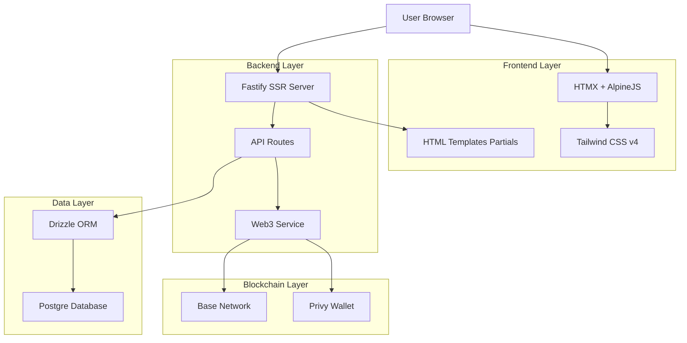
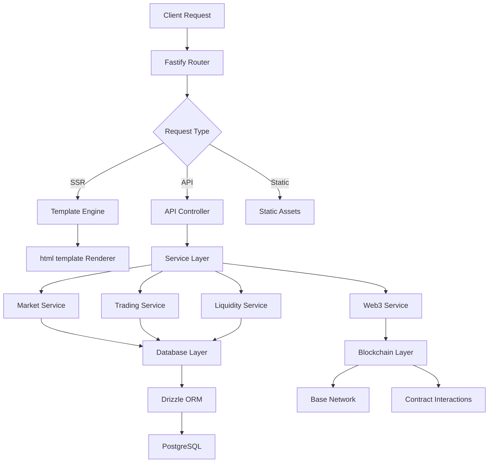

# Technical Architecture

## Core Technology Stack

Foresure is built as a **Server-Side Rendered (SSR)** application to ensure performance, SEO, and a simple mental model.

*   **Frontend**: [HTMX](https://htmx.org/) + [AlpineJS](https://alpinejs.dev/) + [Tailwind CSS v4](https://tailwindcss.com/)
    *   *Why?* Reduced bundle size, better initial load, and simpler state management compared to React.
*   **Backend**: [Fastify](https://www.fastify.io/)
    *   *Why?* Superior performance, built-in schema validation, and excellent TypeScript support.
*   **Database**: [PostgreSQL](https://www.postgresql.org/) + [Drizzle ORM](https://orm.drizzle.team/)
    *   *Why?* ACID compliance for financial data and type-safety.
*   **Blockchain**: [Base Network](https://base.org/) (EVM) + [ethers.js](https://docs.ethers.org/)
    *   *Why?* Low fees, fast block times (2s), and EVM compatibility.

## System Diagram

The following diagram illustrates the high-level architecture of the platform:

## Server Architecture

Requests are handled by Fastify, which routes them either to the Template Engine (for HTML pages) or the API Controller (for JSON data).

