# 🛠️ Create a Market

Foresure allows anyone to create a prediction market. This guide walks you through the parameters and best practices.

## Market Templates

We offer three core templates to simplify creation:

### 1. Binary (Yes/No)
*   **Best for**: "Will X happen by date Y?"
*   **Outcomes**: 2 (YES, NO)
*   **Example**: "Will Bitcoin exceed $100k in 2024?"

### 2. Categorical (Multiple Choice)
*   **Best for**: Elections, Sports Tournaments.
*   **Outcomes**: 3-8 mutually exclusive options.
*   **Example**: "Who will win the 2024 US Election?" (Democrat, Republican, Other)

### 3. Scalar (Range)
*   **Best for**: Numerical predictions.
*   **Outcomes**: Long/Short within a range.
*   **Example**: "What will be the temperature in NYC on July 4th?" (Min: 60°F, Max: 100°F)

## Configuration Parameters

When creating a market, you must define:

| Parameter | Description | Recommended |
| :--- | :--- | :--- |
| **Question** | The specific event to be predicted. | Be precise and unambiguous. |
| **Resolution Source** | The URL or data feed used to verify the outcome. | Official gov sites, major news (AP/Reuters). |
| **Resolution Date** | When the event is expected to end. | Set 24h *after* the event to allow for reporting. |
| **Bond Amount** | Initial stake to prevent spam. | > $50 USDC |

## Oracle Selection Workflow

1.  **Define Question**: "Will Starship launch successfully?"
2.  **Select Oracle**: Choose the "Optimistic Oracle" (default).
3.  **Set Rules**: "Successful orbit required. Sub-orbital does not count."
4.  **Fund Market**: Provide initial liquidity (e.g., $100 USDC) to bootstrap trading.

```mermaid
graph TD
    Start([Start]) --> Q[Define Question]
    Q --> O[Select Oracle]
    O --> R[Set Resolution Date]
    R --> B[Post Bond]
    B --> L[Add Initial Liquidity]
    L --> End([🚀 Market Live])
```

::: tip
Clear resolution rules prevent disputes later. Always include edge cases (e.g., "What if the launch is scrubbed?").
:::
