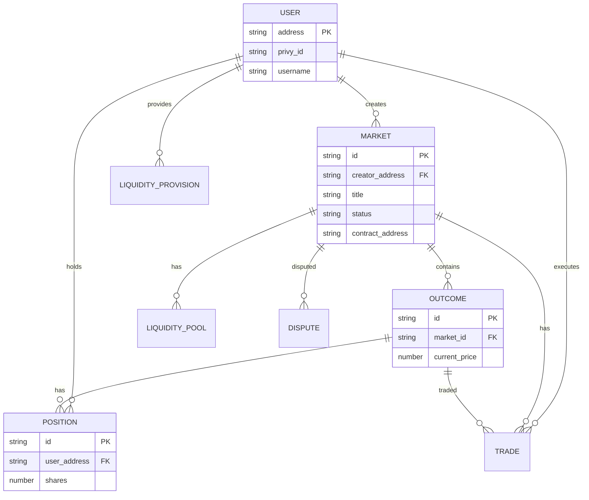

# Database Schema

Foresure uses PostgreSQL with Drizzle ORM. Below is the Entity Relationship Diagram (ERD) and the schema definition.

## Entity Relationship Diagram

## Table Definitions

### Users
Stores user profile and wallet information.
- `address` (PK): Wallet address
- `privy_id`: Unique ID from Privy
- `username`: Display name
- `is_verified`: Verification status

### Markets
The core entity representing a prediction event.
- `id` (PK): UUID
- `creator_address` (FK): Creator's wallet
- `title`: Market question
- `resolution_date`: When the market ends
- `status`: `active`, `resolved`, `disputed`, `finalized`, `cancelled`
- `contract_address`: Address of the on-chain contract

### Outcomes
Possible results for a market (e.g., "Yes", "No").
- `market_id` (FK): Parent market
- `outcome_index`: 0, 1, 2...
- `current_price`: Current trading price (0.0 - 1.0)
- `total_shares`: Total minted shares

### Trades
Record of all buy/sell actions.
- `type`: `buy` or `sell`
- `shares`: Amount of shares traded
- `price`: Price at execution
- `transaction_hash`: On-chain tx hash

### Positions
Current holdings for a user in a specific market outcome.
- `shares`: Net shares held
- `average_price`: Average entry price
- `unrealized_pnl`: Current profit/loss
