#  Dispute Resolution

Disputes ensure the integrity of the platform. If you see a market resolved incorrectly, you can challenge it.

## Filing a Dispute

1.  **Identify Incorrect Resolution**: The market says "YES" won, but you know "NO" won.
2.  **Check Deadline**: You must file within the **24-hour challenge window**.
3.  **Post Bond**: You must stake USDC equal to the current bond (starts at roughly $50 and doubles each round).
4.  **Submit Evidence**: Provide links, screenshots, or official statements proving your claim.

## Evidence Standards

To win a dispute, your evidence must be:
*   **Verifiable**: Publicly accessible URLs.
*   **Authoritative**: Primary sources (e.g., FIFA.com for soccer, SEC.gov for finance) prefered over blogs.
*   **Unambiguous**: Clearly contradicts the proposed outcome based on the market's rules.

## Timeline Visualization

```mermaid
timeline
    title Dispute Resolution Process
    Day 0 : 🏁 Market Ends
          : 📢 Outcome Proposed
    Day 1 : ⏳ Challenge Window (24h)
          : 🚨 Dispute Filed (If Incorrect)
    Day 3 : 🗳️ Jury Voting Starts
    Day 6 : ⚖️ Final Ruling
```

## Risks
If your dispute is rejected by the Jury, you **lose your entire bond**. Only dispute if you are 100% certain.

<!-- 
gantt
    title Dispute Lifecycle
    dateFormat  HH:mm
    axisFormat  %H:%M
    
    section Resolution
    Market Ends           :a1, 00:00, 1h
    Proposed Outcome      :a2, after a1, 1h
    
    section Challenge
    Challenge Window Open :active, a3, after a2, 24h
    Dispute Filed         :crit, a4, 12:00, 1h
    
    section Jury
    Jury Voting Starts    :after a4, 48h
    Final Ruling          :after a4, 72h -->