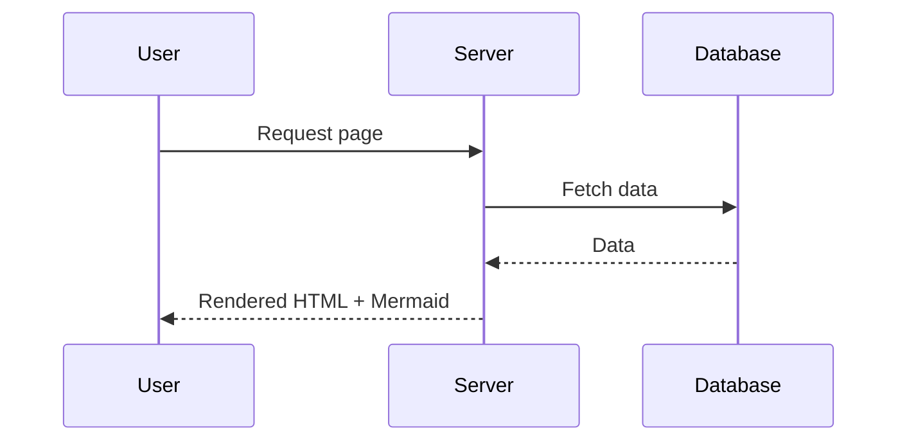
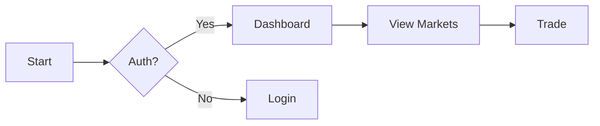

# Mermaid Test

## Math Test

Inline math: $e^{i\pi} + 1 = 0$.

Display math:

$$
\nabla \cdot \vec{\mathbf{B}} = 0 \quad \text{and} \quad
\nabla \times \vec{\mathbf{E}} + \frac{1}{c} \frac{\partial \vec{\mathbf{B}}}{\partial t} = 0
$$