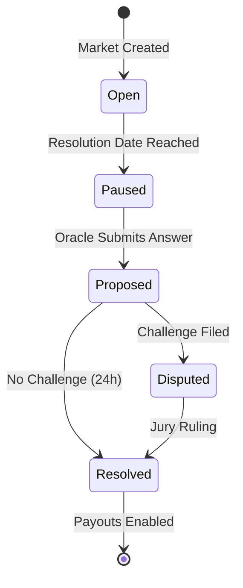

# ✅ Market Resolution

Resolution is the final stage of a prediction market lifecycle.

## Oracle Callback Triggers

Foresure uses a "push" oracle model.
1.  **Time Trigger**: When `ResolutionDate` is passed, the contract enters the `ReadyForResolution` state.
2.  **Data Request**: An automated keeper (or any user) requests data from the Optimistic Oracle.
3.  **Proposal**: The Oracle posts the proposed answer on-chain.

## Payout Execution Flow

Once the resolution is finalized (after the challenge window):

1.  **Minting Stops**: No new shares can be created.
2.  **Redemption Enabled**:
    *   **Winning Shares**: Redeemable 1:1 for USDC.
    *   **Losing Shares**: Worthless ($0).
3.  **LP Withdrawal**: Liquidity providers can withdraw their remaining USDC (which will be comprised entirely of the winning outcome's value + fees).

## Failed Resolution Fallbacks

In rare cases, a market cannot be resolved (e.g., "Game cancelled due to rain").

*   **Status**: `INVALID`
*   **Action**: The contract triggers an **Emergency Refund**.
*   **Result**: All trades are effectively unwound. Users get back their capital proportional to their share of the pool at the time of invalidation.

::: warning
If a market resolves to INVALID, you may still lose a small amount due to fees paid during trading.
:::
