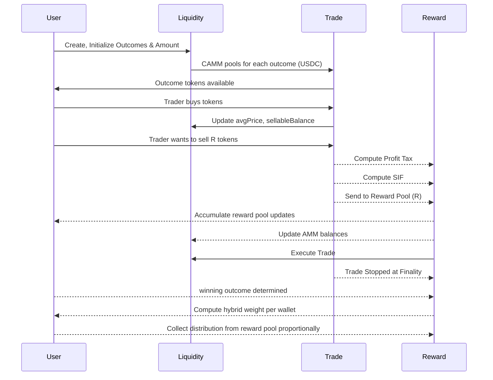

# ⚖️ Hybrid CAMM Design

Foresure employs a **Hybrid Consensus Automated Market Maker (CAMM)** that combines the predictability of Constant Product Market Makers (CPMM) likw UNISWAP V2 with the stability required for prediction markets.

You get the overview from the following sequence diagram

Following are the Core Goals

## 1. Liquidity Concentration

Traditional prediction markets suffer from fragmented liquidity. Foresure utilizes a single liquidity pool per outcomes that collateralizes stables, significantly improving capital efficiency compared to distinct order books based liquidity. 

Loss to the Liquidity Providers (LP) should be zero which means that LPs only provide stables and withdraw same amount plus accumulated fees never outcome tokens. This also ensures that there would be less or no impermanent loss. In fact, funds of LPs ensure depth provision to cater large volumes. Market automatically closes at finite time
horizon and hence no infinite liquidity drain.

## 2. Wisdom of the Crowd
 
Traders belief on outcomes and their trading behavior should provide a probability where group of anons expects the event to happen. Wisdom of the crowd probability is the most important factor to achieve not the individual belief, hence probability signal is derived from aggregate token quantities, rather than probability as instantaneous price.

## 3. Bounded Reward Function

Second point indirectly ensures that only tokens bought from pool can be sold. In any case a Trader's belief
on a outcome is changed, then trying to sell his share of tokens, they should pay their levy to reward pool. This is to ensure that there is a bounded reward function and Pron creators and LPs no need to worry about the bounded loss.

## 4. Optimistic Resolution
We implement an optimistic oracle mechanism that assumes a reported outcome is correct unless disputed. This allows for:
*   **Instant Settlement**: In the happy path, markets resolve immediately.

*   **Decentralized Security**: A dispute window allows any user to bond stake and challenge an incorrect result.

## The Solution: Overview CAMM 

In this section, an overview about the CAMM mechanics briefly presented. If you would like to see the complete math, please go to [**CAMM Math**](./camm-math.md)

### Initialization

Each Pron Market has outcome tokens, each have its own constant product invariant paired with stable reserves. Each of its base token is stable coin. When a Pron initiator adds liquidity then USD stable is equally distributed
to all outcomes. All of the corresponding minted outcome tokens with price fixed are added to the liquidity pool during the Pron initiation.

### Adding Liquidity

If required there may be liquidity bootstrap event to entice large LPs before the initialization. If any new liquidity provider wants to add their share to the pool after the initial creation is just to add stables equally distributed to all outcomes and corresponding outcome tokens would be minted according to the price.

Adding more liquidity to the pool after trade is enabled would still keep the price but the depth is increased. Vice versa for removing LPs. As usual, there would be liquidity fee, trader fees for LPs but collected LP fees via trades are not going to Liquidity Pool. LPs trader fees can either be a fixed value or variable time-weighted since Pron is
time-limited event.

### Trading

After trade is enabled, the outcome tokens can be bought and sold which adds cumulatively to supplied token pool. Based on the quantity of tokens in the supply provides crowd wisdom probability signal which is updated in the frontend system and charts. This provides the actual true belief of the crowd irrespective of the price of the outcome token. 

### Probability

It is also worth noting that it is straightforward to calculate the Crowd Wisdom Probability for binary outcomes like $yes$ or $no$ or direct multi-outcomes. For multi categorical outcome aggregations, all the $yes$ token quantities should be considered for the calculations if each category contains both $yes$ and $no$ tokens. 

Now the major part, if the trader is selling or taking profit out of Pron which results in change of belief in their expected outcome should give a share of their sell as levy which then would be added to rewards pool. Levy is a tax introduced at the trading that penalizes belief-switching and short-term profit extraction which can be a constant value or variable with time weighted constraint. 

### Reward Pool

Reward Pool aggregates collective conviction ensuring that the final payout rewards for those who maintained belief in the realized outcome paid substantially. Reward pool grows from levies ensuring no external debt for Liquidity Providers. Not only that, levy discourages speculative churn to gaming the crowd wisdom and incentivizes belief holding. This structure enforces zero-LP-loss, bounded reward funding, and stable probabilistic inference under finite market closure. 

### Payout

At the finality of the event, the resolution outcome confirmed via oracle or internal protocol as the actual event, then only the holders of resolution outcome's tokens would receive the reward. The total reward is ratio of all the additional money in pool besides Liquidity by LPs to the quantity of the resolution outcome's token. Remember that all the outcome tokens other than resolution outcome would be paid zero. With this innovative setup, anyone believing in a outcome of a Pron can trade the tokens and imply the crowd wisdom probability and earn the payout for their predictions. 

### Invariant Formula

The core of our AMM is the constant product formula, When a user buys outcome A, they add USDC to the pool and remove outcome A tokens. This changes the ratio of reserves, updating the price.

### Price Determination

The spot price of outcome is defined as the instantaneous cost to buy a marginal amount of outcome $i$ in terms of the numeraire (USDC).

### Liquidity Efficiency

By pooling liquidity, LPs earn fees from trading volume across all outcomes. This incentivizes passive liquidity provision, solving the "chicken and egg" problem of new markets.
