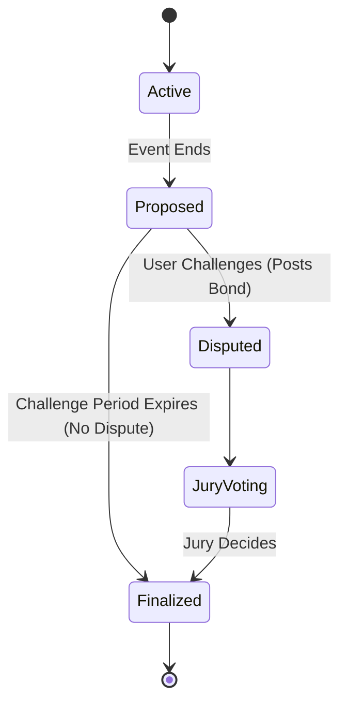

# 🔮 Optimistic Oracle

*This documentation is in editing mode. The content here is not finalized.*

Foresure utilizes a decentralized **Optimistic Oracle** mechanism to bring real-world data on-chain efficiently.

## Philosophy
"Optimistic" means we assume data submitted is correct. We only verify it if someone challenges it. This reduces gas costs and latency by 99% compared to traditional on-chain voting for every event.

## Resolution Flow

1.  **Proposal**: A market ends. The creator is the proposer in our oracle. For anyone else have to bond USDC tokens to propose the outcome (e.g., "Team A won").
2.  **Challenge Period**: A window (e.g., 24 hours) opens.
    *   **No Challenge**: If no one disputes, the outcome is finalized.
    *   **Challenge**: If someone disputes, they must post a matching bond. The market goes to a **Jury Vote**.

## Griefing Protection

A complete detailed dispute section will be added sooner.

To prevent malicious users from delaying resolution ("griefing"), the bond requirement doubles with each consecutive dispute on the same market.

$$ \text{Bond}_{n} = \text{BaseBond} \cdot 2^n $$

This exponential cost makes spamming disputes economically infeasible.

